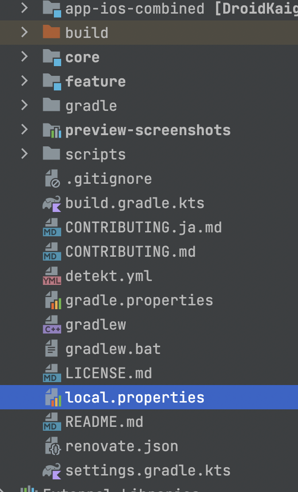

## Get Started

### Setup
- Build Kotlin Multiplatform Mobile XCFramework for iOS

```sh
cd ../
./gradlew appioscombined:assembleXCFramework
```

### Open project with Xcode
```sh
 open DroidKaigi2022/DroidKaigi2022.xcodeproj
```

### Building prerequisite

- As we run gradle task as a part of buliding, Xcode needs to know location of your java home. Usually you should be able to find out about this by type command

```sh
echo $JAVA_HOME
```

If you java home is not found, you need to install it as it is a required for building this iOS app for DrodKaigi.

- Setup you Java home location found above in the file called `local.properties`. Usually, this file is created automatically once you successfully loaded project with Android Studio. If you don't find this file, you can craete this file manually at the root of the project.



- Add content of your JAVA_HOME into the file with the key `org.gradle.java.home=<YOUR_JAVA_HOME_PATH>`


## Requirements
- Xcode 13.4.1
  > **Warning**
  > If you cloned for the first time, you need to try some workaround. Please check it. [Workaround needed for build](#workaround)
- Xcode 14.0 or Later (Recommended)

## Source Code
### Architecture
[The Composable Architecture](https://github.com/pointfreeco/swift-composable-architecture)

### Project Structure
Feature based module definition.

## Development Tools
Development tools are introduced by Swift Package Manager Plugin.

- [SwiftLint](https://github.com/realm/SwiftLint)
- [SwiftGen](https://github.com/SwiftGen/SwiftGen)

In this project, these packages are local plugin (Local defined plugin) and the why of using local plugin is performance issue of Xcode. When using remote package plugin, Xcode CPU usage becomes so high (over 100%).

### Code sample

```swift
import PackagePlugin

@main
struct SwiftLintPlugins: BuildToolPlugin {
    func createBuildCommands(context: PluginContext, target: Target) async throws -> [Command] {
        return [
            .buildCommand(
                displayName: "Linting \(target.name)",
                executable: try context.tool(named: "swiftlint").path,
                arguments: [
                    "lint",
                    "--in-process-sourcekit", // alternative to the environment variable
                    target.directory.string   // only lint the files in the target directory
                ],
                environment: [:]
            )
        ]
    }
}

```

## Workaround
### Xcode 13.4.1

For building this App with Xcode 13.4.1, we need to run following before build whole app.
Some targets that depends on SwiftGenPlugin needs to build individualy.

For example, a target "Theme" depends on "SwiftGenPlugin", it needs to build individualy.

### Xcode Previews

Before preview resume, specifying "Target" that a preview target view is belonged is needed.

For example, when preview "AboutView", specify "AboutFeature".
